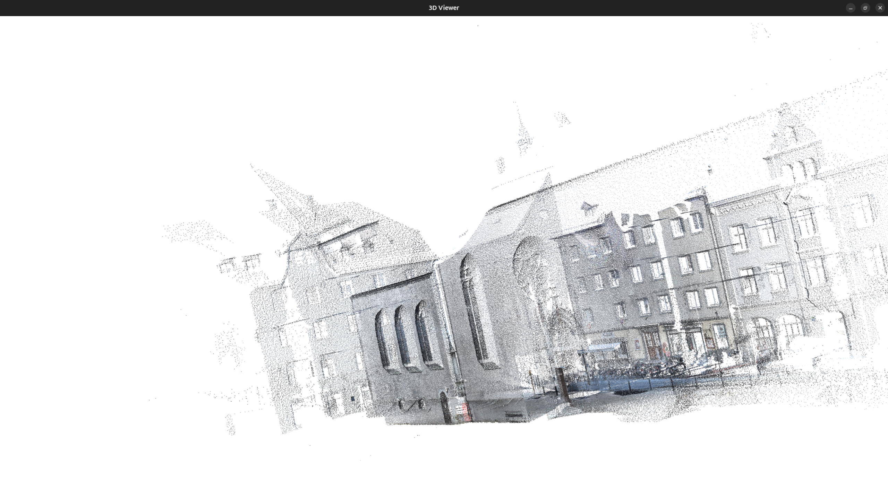
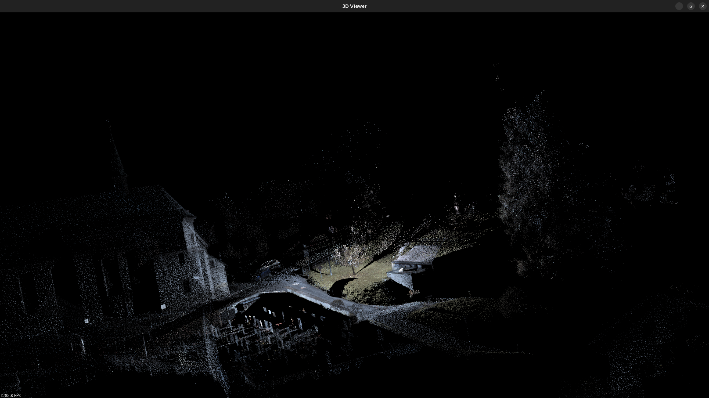

# Point Cloud Viewer

A C++ application for visualizing 3D point cloud datasets with interactive viewing capabilities. 

## Screenshots

<p align="center">
    
    
</p>

## Technologies

- **C++17**: Modern C++ standard
- **PCL (Point Cloud Library)**: 3D point cloud processing and visualization
- **CMake**: Build system configuration
- **Standard Library**: Filesystem, streams, and containers


### Installing PCL

**Ubuntu/Debian:**
```bash
sudo apt-get install libpcl-dev
```

**macOS:**
```bash
brew install pcl
```

**Windows:**
Download from [PCL official website](https://pointclouds.org/downloads/)

## Building

1. Clone or navigate to the project directory:
```bash
cd point-cloud
```

2. Create and navigate to build directory:
```bash
mkdir -p build && cd build
```

3. Configure with CMake:
```bash
cmake ..
```

4. Compile:
```bash
make
```

## Usage

1. **Prepare your data**: Add point cloud files to the `data/` directory

2. **File format**: Your files should contain space-separated values, one point per line:
   - **Without intensity**: `x y z r g b`
   - **With intensity**: `x y z intensity r g b`

   Example:
   ```txt
   -2.064 -10.433 -0.942 -1176 108 102 88
   -2.073 -10.424 -0.941 -1168 127 125 100
   ```

3. **Run the application**:
   ```bash
   ./pcv
   ```

4. **Follow the prompts**:
   - Select a file by number
   - Choose background color (black/white)
   - Interact with the 3D viewer
